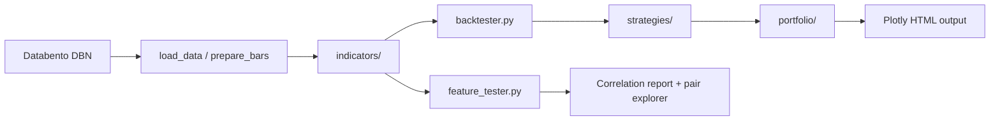

# Agent Guide — Option Backtester

This document is for AI agents (and humans) extending this repo. Read it before adding indicators, strategies, tests, or CLI tools.

## What this project does

Local backtesting and feature research on Databento OHLCV data:

| Entry point | Purpose |
|-------------|---------|
| `backtester.py` | Load bars → compute indicators → run strategy → plot HTML chart with portfolio PnL |
| `feature_tester.py` | Load bars → build features + forward targets → rank correlations → interactive HTML report |

Both use `--instrument` (default `SPY`) and share data helpers from `backtester.py`.



## Repository layout

```
backtester/
├── backtester.py          # CLI: backtest + chart (data loading, plotting, backtest loop)
├── feature_tester.py      # CLI: feature analysis + HTML report
├── indicators/            # Pure functions: bars → indicator columns
│   ├── __init__.py        # Public exports
│   ├── vpin_spread.py
│   └── vpin_lsf.py
├── strategies/            # Bar-by-bar order generation
│   ├── base.py            # BaseStrategy ABC
│   ├── vpin_spread.py
│   └── vpin_demo.py
├── portfolio/             # Positions, fills, exposure, performance metrics
│   ├── core.py
│   └── performance.py
├── tests/                 # unittest (no pytest required)
├── data/                  # Per-instrument Databento files: data/<SYMBOL>/ohlcv-1m.dbn.zst
└── output/                # Generated HTML/CSV
```

## Core conventions

### Bar data contract

Indicators and strategies expect a `pd.DataFrame` indexed by `DatetimeIndex` with columns:

```
open, high, low, close, volume
```

- Timezone: `America/New_York` (set in `load_data`)
- `prepare_bars()` strips extras and sorts by time
- `resample_bars(bars, interval)` — use `"none"` for raw 1-minute bars

### Instrument handling

- CLI flag: `--instrument SPY` (default `SPY`)
- `load_data(path, instrument=...)` filters by `symbol` / `raw_symbol` when present
- Portfolio/strategy use the instrument string as the position symbol
- Default outputs: `output/{instrument}_price.html`, `output/{instrument}_feature_report.html`

### Timeframe labels

Used in column suffixes and horizons:

| Label | Meaning (1m base data) |
|-------|------------------------|
| `5m`, `15m`, `30m` | Intraday minutes |
| `1h`, `4h` | Intraday hours |
| `1d` | 390 minutes (regular session) |
| `7d`, `28d`, … | N × 390 minutes |

Feature columns from multi-timeframe indicators: `{base_name}_{timeframe}`  
Example: `spread_cross_top_4h`, `vpin_signed_15m`

Forward targets: `fwd_{metric}_{horizon}`  
Example: `fwd_realized_volatility_7d`, `fwd_return_5m`

Bar-window features (OHLCV only): `{name}_{N}b` — **N bars**, not clock time  
Example: `log_return_1b` = 1-bar log return; `realized_variance_390b` = 390-bar window

### Exposure / orders

Strategies emit `Order` objects; `Portfolio.execute_order()` fills them.

| Action | Meaning |
|--------|---------|
| `TARGET` | Set net exposure to `target_exposure` (fraction of equity, e.g. `0.5` = 50% long) |
| `FLATTEN` | Close position (`target_exposure=0`) |
| `BUY` / `SELL` | Legacy directional helpers |
| `HOLD` | No trade |

Exposure is **not** share count — it is `target_notional / equity`.

---

## Adding a new indicator

### 1. Create the module

Add `indicators/my_indicator.py`:

```python
from __future__ import annotations

from dataclasses import dataclass

import pandas as pd


@dataclass(frozen=True)
class MyIndicatorConfig:
    lookback: int = 20

    @property
    def warmup_bars(self) -> int:
        """Bars needed before signals are valid — used for chart warmup."""
        return self.lookback


def compute_my_indicator(
    bars: pd.DataFrame,
    config: MyIndicatorConfig | None = None,
) -> pd.DataFrame:
    config = config or MyIndicatorConfig()
    # Validate: require open/high/low/close/volume
    close = bars["close"].astype(float)

    result = pd.DataFrame(index=bars.index)
    result["my_signal"] = ...        # continuous values
    result["my_cross_top"] = ...     # bool signals (cast to int in feature_tester if needed)

    return result
```

**Rules:**

- Input: OHLCV bars only — no side effects, no file I/O
- Output: `pd.DataFrame` with same index as `bars` (or subset with NaN warmup)
- Config: `@dataclass(frozen=True)` with `warmup_bars` if rolling windows are used
- Prefix column names to avoid collisions (e.g. `my_signal`, not `signal`)
- Booleans: fine in indicators; `feature_tester` casts bool columns to int in `compute_single_timeframe_vpin`

### 2. Export from `indicators/__init__.py`

```python
from .my_indicator import MyIndicatorConfig, compute_my_indicator

__all__ = [..., "MyIndicatorConfig", "compute_my_indicator"]
```

### 3. Wire into `backtester.py` (if used for charting/backtest)

Typical pattern in `prepare_chart_data()`:

```python
from indicators import MyIndicatorConfig, compute_my_indicator

analysis_bars = add_history_context(bars, chart_bars, config.warmup_bars)
indicators = compute_my_indicator(analysis_bars, config)
chart_data = analysis_bars.join(indicators).loc[chart_bars.index]
```

- Always include **warmup history** before the visible chart window
- Join indicators onto bars; slice to `chart_bars.index` for display

### 4. Wire into `feature_tester.py` (for correlation research)

**Option A — inside existing VPIN pipeline** (multi-timeframe):

Edit `compute_single_timeframe_vpin()` to join your indicator output.

**Option B — separate indicator family** (recommended for non-VPIN):

1. Add `compute_my_indicator_features()` mirroring `compute_indicator_features()`
2. Call it from `build_feature_frame()` alongside technical + VPIN features
3. Register signal columns in `VPIN_SIGNAL_FEATURES` **or** add a new feature-set enum:

```python
# feature_tester.py
MY_SIGNAL_FEATURES = {"my_signal", "my_cross_top"}

def is_my_feature(column: str) -> bool:
    return base_vpin_feature_name(column) in MY_SIGNAL_FEATURES
```

Update `select_feature_columns()` if you add a new `--feature-set` choice.

**Multi-timeframe:** suffix with `_{label}` via `suffix_timeframe_columns()` and align back to 1m index with `align_timeframe_features()` (forward-fill).

### 5. Tests

Add `tests/test_my_indicator.py`:

```python
import unittest
import pandas as pd
from indicators import MyIndicatorConfig, compute_my_indicator

class MyIndicatorTests(unittest.TestCase):
    def test_outputs_expected_columns(self) -> None:
        bars = pd.DataFrame({...}, index=pd.date_range(..., freq="min"))
        result = compute_my_indicator(bars, MyIndicatorConfig(lookback=5))
        self.assertIn("my_signal", result.columns)
        self.assertEqual(len(result), len(bars))
```

Run: `python -m unittest discover -s tests -v`

---

## Adding a new strategy

### 1. Create the module

Add `strategies/my_strategy.py`:

```python
from __future__ import annotations

import pandas as pd

from portfolio import FLATTEN, TARGET, Order, Portfolio
from .base import BaseStrategy


class MyStrategy(BaseStrategy):
    def __init__(self, symbol: str = "SPY", ...) -> None:
        self.symbol = symbol
        # Stateful fields OK (position tracking, bars held, etc.)

    def generate_orders(
        self,
        timestamp: pd.Timestamp,
        row: pd.Series,
        portfolio: Portfolio,
    ) -> list[Order]:
        price = float(row.get("close", 0.0))
        # Read indicator columns from row: row.get("my_cross_top", False)
        # Return [] when no action
        return [
            Order(
                timestamp=timestamp,
                symbol=self.symbol,
                action=TARGET,
                target_exposure=1.0,
                reason="Describe why",
            )
        ]
```

**Rules:**

- **Pure per-bar decision**: `generate_orders(timestamp, row, portfolio)` — no lookahead
- Read signals from `row` (indicator columns joined onto chart data)
- Use `portfolio.get_position(symbol)` and `portfolio.snapshot(timestamp, {symbol: price})` for exposure
- Return `[]` when idle; never raise on missing optional signals — default safely
- Stateful strategies: reset state on flatten/exit (see `VPINDemoStrategy._reset_position_state`)

### 2. Export from `strategies/__init__.py`

```python
from .my_strategy import MyStrategy
__all__ = [..., "MyStrategy"]
```

### 3. Wire into `backtester.py`

Update `run_portfolio_backtest()`:

```python
from strategies import MyStrategy

strategy = MyStrategy(symbol=instrument, ...)
```

Ensure `prepare_chart_data()` computes every column your strategy reads.

Add CLI flags in `parse_args()` for strategy parameters; pass through `main()`.

Optional: add `--strategy` choice if multiple strategies coexist.

### 4. Tests

Copy patterns from `tests/test_vpin_spread.py`:

- Indicator smoke test (columns exist, length matches)
- Strategy emits `TARGET` on signal bar
- Strategy emits `[]` on quiet bar
- `close_after_bars` / flatten behavior if applicable

Test with `Portfolio(initial_cash=100_000, default_symbol="SPY")` and synthetic `pd.Series` rows — no need for full DBN files in unit tests.

---

## Portfolio layer (usually no changes needed)

`portfolio/core.py` handles:

- Position averaging, realized/unrealized PnL
- `execute_order(order, price)` → `Fill`
- `mark(timestamp, prices)` → `PortfolioSnapshot`

`portfolio/performance.py` computes CAGR, drawdown, etc. for debug output.

Only extend portfolio when you need new order types, multi-leg positions, or options-specific greeks.

---

## Feature tester specifics

### Pipeline

```
bars → compute_technical_features (OHLCV)
     → compute_indicator_features (VPIN family, multi-TF)
     → compute_forward_targets (fwd_* columns)
     → correlations / quantile buckets / HTML report
```

### Forward targets

Produced by `compute_forward_targets()` — do not hand-edit `fwd_*` columns. Horizons come from `--horizons` (e.g. `5m,1d,7d`).

### Feature sets (`--feature-set`)

| Value | Includes |
|-------|----------|
| `vpin` | `VPIN_SIGNAL_FEATURES` only (default) |
| `all` | All numeric non-OHLCV features including internals |
| `ohlcv` | Technical features only |

### HTML pair explorer

Clicking a table row plots (at the **feature's timeframe**):

1. Price  
2. Log return matched to **target horizon** (e.g. `7d`)  
3. Signal (feature value)  
4. Forward target  

If you add indicators with `_4h` suffixes, the explorer auto-resamples to 4h bars.

### CSV outputs (`output/features/`)

- `correlations.csv`, `quantile_buckets.csv`, `top_features.csv`
- Optional `feature_frame_sample.csv` with `--sample-rows N`

---

## Backtester chart specifics

`plot_backtest()` renders 3 rows: price (+ trade markers), indicator panel, portfolio PnL/exposure.

When adding a new indicator panel:

- Add traces in `plot_backtest()` or extract a `plot_my_indicator()` helper
- Reuse `spread_color_masks()` pattern for signal coloring
- Keep `add_trade_markers(figure, fills)` on the price row

---

## CLI checklist for new work

When exposing new functionality:

1. Add argparse flags with sensible defaults
2. Use `DEFAULT_INSTRUMENT = "SPY"` pattern; never hardcode filenames with instrument name in code paths — use `default_output_path(instrument, stem)`
3. Support `--no-open` to skip browser
4. Print summary stats at end (rows loaded, fills, top correlation, etc.)
5. Return `0` / `1` exit codes from `main()`

---

## Testing & verification

```bash
# All tests
python -m unittest discover -s tests -v

# Single module
python -m unittest tests.test_vpin_spread -v

# Smoke run (requires data file)
python backtester.py --instrument SPY --date latest --no-open
python feature_tester.py --instrument SPY --date all --no-open --no-progress
```

**Always add tests** for new indicators and strategies. Keep tests deterministic with synthetic bars.

---

## Common pitfalls

| Mistake | Fix |
|---------|-----|
| Indicator missing warmup | Pass `warmup_bars` history via `add_history_context()` before chart slice |
| Strategy reads column not joined | Ensure `prepare_chart_data()` / `build_feature_frame()` computes it |
| Lookahead bias | Forward targets use `shift(-h)`; strategies must only use current/past `row` values |
| `1b` vs `1m` vs `1d` | `1b` = bars; `1m`/`1d` = clock labels on forward targets and TF-suffixed features |
| Huge HTML report | Pair explorer downsamples to 5,000 points; full data stays in CSV |
| Forgetting `__init__.py` exports | New modules are invisible until exported |
| Hardcoded SPY | Use `--instrument` / `DEFAULT_INSTRUMENT` |

---

## Minimal end-to-end checklist

Adding a complete signal → strategy → chart loop:

- [ ] `indicators/my_signal.py` with config + `compute_*` + `warmup_bars`
- [ ] Export in `indicators/__init__.py`
- [ ] `tests/test_my_signal.py`
- [ ] `strategies/my_strategy.py` extending `BaseStrategy`
- [ ] Export in `strategies/__init__.py`
- [ ] `tests/test_my_strategy.py`
- [ ] `backtester.py`: join indicator in `prepare_chart_data()`, use strategy in `run_portfolio_backtest()`, plot if needed
- [ ] Optional: `feature_tester.py` registration + correlation tests
- [ ] Run full test suite
- [ ] Smoke-run both CLIs

---

## Dependencies

```
databento
numpy
pandas
plotly
```

No pinned versions in `requirements.txt` — match existing code style (type hints, `from __future__ import annotations`, dataclasses).

---

## Reference implementations

| Pattern | File |
|---------|------|
| Indicator + config + bool signals | `indicators/vpin_spread.py` |
| Second indicator joined in same TF | `indicators/vpin_lsf.py` |
| Simple strategy (signal → TARGET) | `strategies/vpin_spread.py` |
| Stateful strategy (scale-in, reset) | `strategies/vpin_demo.py` |
| Multi-TF feature alignment | `feature_tester.py` → `compute_indicator_features()` |
| Backtest loop | `backtester.py` → `run_portfolio_backtest()` |
| Unit tests | `tests/test_vpin_spread.py` |

When in doubt, copy the closest reference and adapt — keep the same contracts.